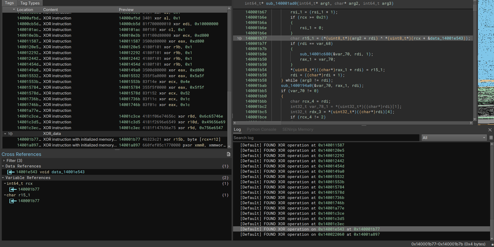

# XOR Finder
Author: **ghozt**

_XOR operation identification_

## Description:
This plugin identify and tag xor operation based on two methods:
 - Dumb mode: Just list all xor operation with different operands.
 - Data mode: Tag all xor operation involving initialiazed data.

 Maybe this can help in malware reversing or CTF :)

## License

This plugin is released under an [MIT license](./license).
